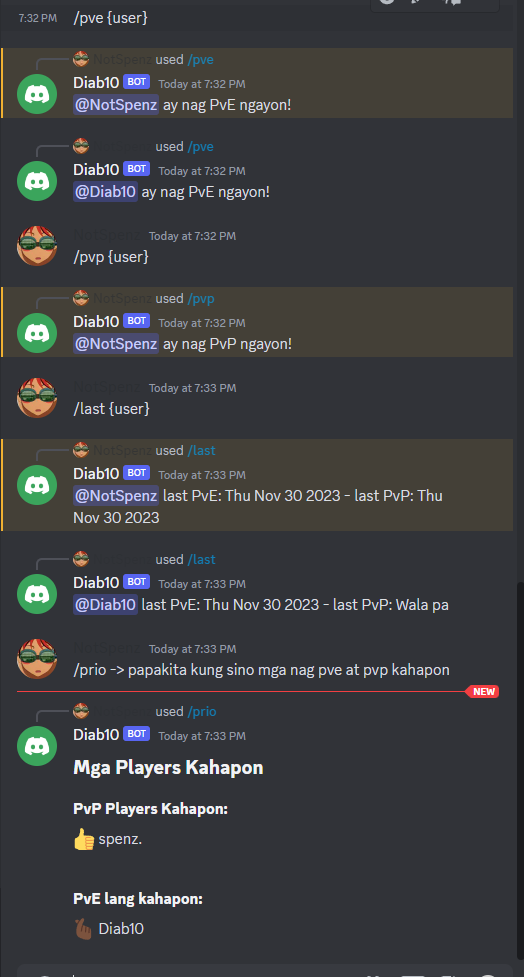

# Diab10 - 10v10 Discord Bot Tracker

Keep track of all your member's content and commitment to be the best player for the team. Add Diab10 to your Discord Server to determine who has priority through their commitments.

## Commands
### Hellgates
| Command | Options | Description |
| -------- | -------- | -------- |
| /pve   | {username} **Required**   | Add player count for PvE content and the current time and date of their latest PvE content.   |
| /pvp   | {username} **Required**   | Add player count for PvP content and the current time and date of their latest PvP content.    |
| /prio | *none* | Determine which player has priority by determining who were the players who did PvE and PvP for the last 24 hours the command was issued
| /last | {username} **Required** | Get information about the player's the date last played for each content (PvP or PvE)

### Additional
| Command | Options | Description |
| -------- | -------- | -------- |
| /server | *none* | Provides information about the server |
| /user | {username} **Optional** | Provides information about the user |

## Database
MongoDB is used to store all of the data. This is decided due to its flexibility in the early parts of development. *If the business needs changes, we can consider changing this.*

## Tech Stack
- JavaScript
- Discord.js
- Mongoose

## Improvements
Currently, the bot is hosted in Render. It gets offline sometimes, but Render does a good job restarting the deploy once it hears a request. I feel this is sufficient right now for its use case.

## Next Phase of Development
In the next phase of development, I would add commands for users to enter a queue to let leader know they are waiting. At the same time, adding a command for leaders to remove them from queue.

I will add another command to show all of the users content consumption in a calendar format.

I will also add a feature to the code that will allow different Discord servers have access to their own collection/database.

## Resources
- [Connect DB to Discord.js](https://www.youtube.com/watch?v=a3Gz_7KEJkQ)
- [Mongoose Documentation - .save()](https://mongoosejs.com/docs/documents.html)
- [Get all of the documents created or updated in the last 24 hours](https://stackoverflow.com/questions/72056178/how-to-get-mongo-documents-created-in-the-last-24-hours-using-mongoose)
- [Mentioning users using user.id](https://v12.discordjs.guide/miscellaneous/parsing-mention-arguments.html#how-discord-mentions-work)
- [JavaScript.Array.some() Method](https://developer.mozilla.org/en-US/docs/Web/JavaScript/Reference/Global_Objects/Array/some)
- [Mentioning users using interaction parameter](https://stackoverflow.com/questions/71049909/discord-js-slash-command-mention-user)
- [Managing Bot Permissions in Channels](https://www.reddit.com/r/discordapp/comments/z6ru61/how_do_i_restrict_each_bots_slash_commands_to/)